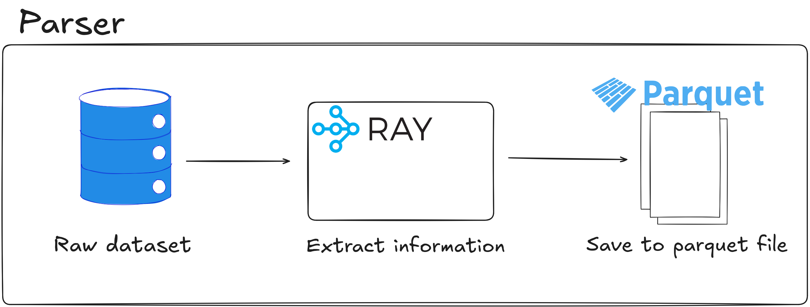
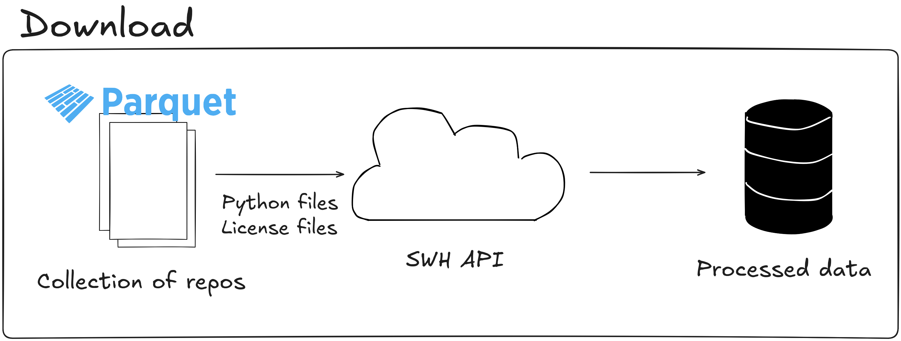

# Data

Write-up: https://dudeperf3ct.github.io/projects/train_llm_part0/

## Pre-requisites

- `uv`

## Getting Started

1. Install the dependencies:

  ```bash
  uv sync
  ```

2. Configure the settings in `config.yaml` as needed.

3. Run the dataset parsing script from root of the repo. It downloads the dataset on the first run if not already present at `data/raw_dataset/<name-of-dataset>` path.

  ```bash
  cd ..
  python -m codellm_data.main parse
  ```
4. Run the dataset downloading script from root of the repo.

  ```bash
  cd ..
  python -m codellm_data.main download
  ```

## Architecture

### Parser



### Downloader


