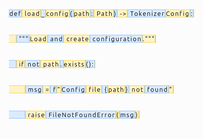

# Tokenizer

Write-up: https://dudeperf3ct.github.io/projects/train_llm_part1/

Train a custom byte-level BPE tokenizer using subset of [`tokyotech-llm/swallow-code-v2`](https://huggingface.co/datasets/tokyotech-llm/swallow-code-v2) dataset.

## Pre-requisites

- `uv`
- `huggingface-cli login` (optional, only if pushing artefacts)

## Getting Started

1. Install the dependencies:

  ```bash
  uv sync
  ```

2. Configure the settings in `config.yaml` as needed.

3. Train the tokenizer (runs with streaming HF dataset) and run a quick evaluation after training.

  ```bash
  python main.py --run-eval
  ```

The path to save trained tokenizer can be configured in `config.yaml` file. By default it saves the tokenizer to the `[artefacts](./artefacts)` folder.

> [!NOTE]
> If `hf auth login` is configured, the Hugging Face token will be used to push the tokenizer to the Hugging Face repo.

## Visualise the tokenizer

Use the helper script to inspect how the text is split into tokens:

```bash
python visualise_tokenizer.py --text "def hello_world(x): return x + 42"  --show-pre-tokenizer
```

Pass `--show-pre-tokenizer` to also see the pre-tokenizer splits, or `--file path/to/code.py` to tokenize a file. The script defaults to `config.yaml` to locate `tokenizer.json` unless `--tokenizer` is provided.

To emit the interactive Tokenizers HTML visualizer:

```bash
python visualise_tokenizer.py --text "def hello_world(x): return x + 42" --html-out artifacts/viz.html --high-contrast
```

Pass `--high-contrast` for more distinct alternating token colours. The output can be visualised by opening the HTML file at the `--html-out` path.

More examples:

- View pre-tokenizer splits for FIM tokens:
  `python visualise_tokenizer.py --text "<|fim_prefix|>def add(x, y):<|fim_suffix|>" --show-pre-tokenizer`
- Compare indentation handling:
  `python visualise_tokenizer.py --text "for i in range(3):\n    print(i)\n\tprint('tab')" --show-pre-tokenizer`
- Skip the terminal table and only emit HTML (avoids huge tables for large inputs):
  `python visualise_tokenizer.py --file main.py --html-out artifacts/viz.html --no-table --high-contrast`

> [!TIP]
> Scroll the HTML file to see the entire output.

There is also a small programmatic demo in `example_viz.py`; run `python example_viz.py` to generate a couple of HTML visualisations under `artifacts/examples/`.



In token visualisations:
* Each distinct background colour = one token
* Adjacent characters with the same colour belong to the same token
* A colour change means a token boundary
